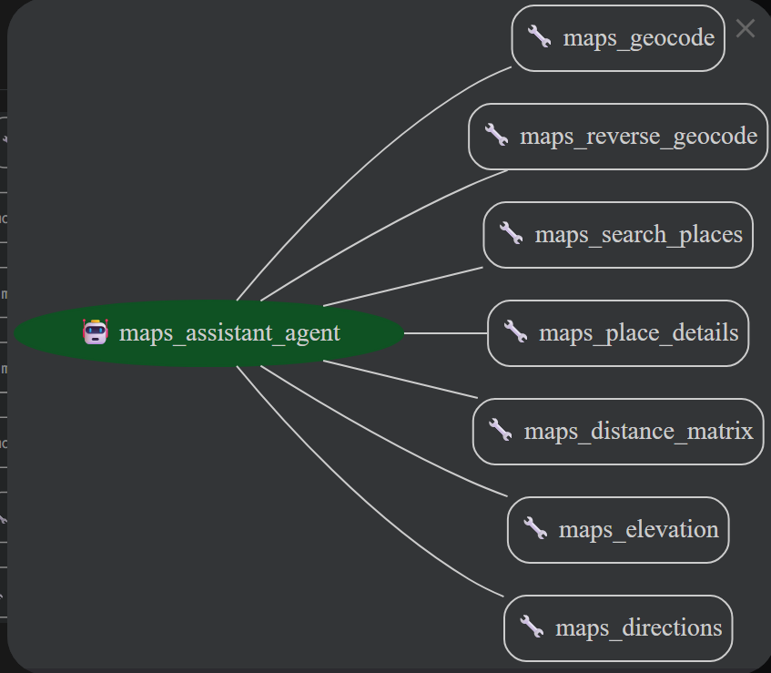
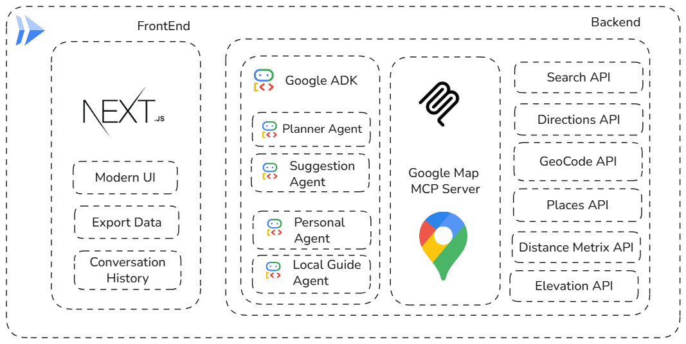
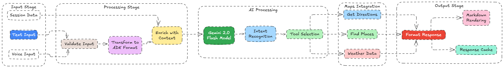
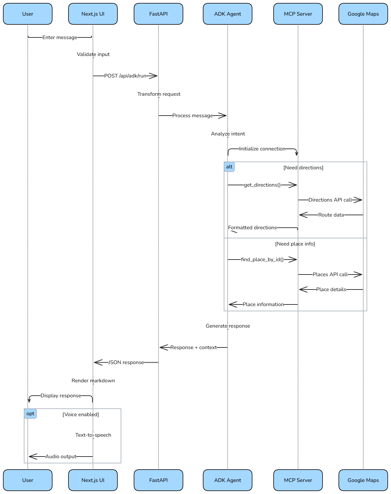

# GMap-Buddy 🗺️

An AI-powered Google Maps assistant that helps you plan amazing road trips and explore the world with intelligent route planning, location discovery, and personalized travel recommendations.

[](https://opensource.org/licenses/MIT)
[](https://www.python.org/downloads/)
[](https://nextjs.org/)
[](https://github.com/google/agent-development-kit)
[](https://github.com/Yash-Kavaiya/GMap-Buddy/issues)

## 🌟 Overview

GMap-Buddy is an intelligent road trip planning assistant powered by Google's Agent Development Kit (ADK) and the Model Context Protocol (MCP). It combines the power of AI with Google Maps services to create personalized travel experiences, complete with route optimization, weather forecasts, accommodation suggestions, and local recommendations.


*Modern and intuitive chat interface for seamless trip planning*

## ✨ Features

### 🤖 AI-Powered Trip Planning
- **Intelligent Route Optimization** - AI analyzes your preferences to create the perfect itinerary
- **Conversational Interface** - Natural language interaction for easy trip planning
- **Personalized Recommendations** - Tailored suggestions based on your interests and budget
- **Multi-Day Trip Support** - Break down long journeys with strategic stopping points

### 🗺️ Advanced Mapping Capabilities
- **Real-time Directions** - Get up-to-date routing with traffic considerations
- **Location Discovery** - Find attractions, restaurants, and points of interest
- **Place Details & Reviews** - Comprehensive information about destinations
- **Custom Waypoints** - Add multiple stops to your journey

### 🌤️ Smart Travel Assistance
- **Weather Forecasts** - Get weather information for your entire route
- **Clothing Recommendations** - AI suggests appropriate attire for each destination
- **Pet-Friendly Options** - Special accommodations for travelers with pets
- **Budget-Conscious Planning** - Options for every budget level

### 🏗️ Technical Features
- **Google ADK Integration** - Built on Google's Agent Development Kit
- **Model Context Protocol (MCP)** - Seamless tool integration and extensibility
- **Next.js Frontend** - Modern, responsive web interface
- **FastAPI Backend** - High-performance Python API
- **Docker Support** - Containerized deployment ready
- **Cloud Run Compatible** - Easy deployment to Google Cloud


*Model Context Protocol (MCP) integration showing available map tools and capabilities*

## 🚀 Getting Started

### Prerequisites

- **Python 3.11+** - For the backend API and AI agent
- **Node.js 18+** - For the Next.js frontend
- **Google Maps API Key** - [Get one here](https://developers.google.com/maps/documentation/javascript/get-api-key)
- **Docker** (optional) - For containerized deployment
- **Google Cloud CLI** (optional) - For Cloud Run deployment

### Quick Start

1. **Clone the repository:**
```bash
git clone https://github.com/Yash-Kavaiya/GMap-Buddy.git
cd GMap-Buddy
```

2. **Set up environment variables:**
```bash
# Create and configure your environment
export GOOGLE_MAPS_API_KEY="your_api_key_here"
```

3. **Choose your deployment method:**

#### Option A: Docker (Recommended)
```bash
# Build and run with Docker
docker build -t gmap-buddy .
docker run -d \
  -p 8080:8080 \
  -e GOOGLE_MAPS_API_KEY="your_api_key_here" \
  --name gmap-buddy-container \
  gmap-buddy
```

#### Option B: Local Development
```bash
# Install Python dependencies
pip install -r requirements.txt

# Install and build frontend
cd adk-ui
npm install
npm run build
cd ..

# Start the application
python -m gmap_buddy.main
```

Your GMap-Buddy will be available at `http://localhost:8080`

### 🐳 Docker Deployment

The application uses a multi-stage Docker build for optimal performance and security:

```bash
# Build the Docker image
docker build -t gmap-buddy .

# Run the container
docker run -d \
  -p 8080:8080 \
  -e GOOGLE_MAPS_API_KEY="your_api_key_here" \
  --name gmap-buddy-container \
  gmap-buddy

# Check container health
docker ps
curl http://localhost:8080/health
```

### ☁️ Google Cloud Run Deployment

Deploy to Google Cloud Run with the included deployment configuration:

```bash
# Enable required Google Cloud APIs
gcloud services enable run.googleapis.com
gcloud services enable cloudbuild.googleapis.com

# Set your project and region
gcloud config set project YOUR_PROJECT_ID
gcloud config set run/region us-central1

# Deploy with Cloud Build
gcloud run deploy gmap-buddy \
  --source . \
  --platform managed \
  --allow-unauthenticated \
  --set-env-vars="GOOGLE_MAPS_API_KEY=your_api_key_here"
```

The deployment will:
- Build the container using Cloud Build
- Deploy to Cloud Run with auto-scaling
- Configure health checks and security settings
- Provide a public HTTPS URL

## 📖 Usage

### Chat Interface

GMap-Buddy provides a conversational interface where you can naturally describe your travel needs:

```
👋 Hi! I'm your road trip planning assistant. Where would you like to start your journey?

User: I want to plan a 3-day road trip from San Francisco to Los Angeles via Big Sur

🗺️ Great choice! That's one of the most scenic routes on the West Coast. Let me help you plan this amazing trip...
```

### Conversation Flow

The AI assistant follows a structured approach:

1. **Starting Point** - Where your journey begins
2. **Destination** - Where you're heading (with scenic route options)
3. **Duration** - How many days you have available
4. **Preferences** - Travel style, budget, interests, pets, dietary needs
5. **Custom Itinerary** - Personalized recommendations with weather and packing advice

### Example Interaction

```
🚗 Road Trip Assistant: Where would you like to start your journey?
User: San Francisco

🗺️ Perfect! Where are you heading?
User: Los Angeles, but I'd like to take the scenic route through Big Sur

⭐ Excellent choice! How many days do you have for this trip?
User: 3 days

🐕 Are you traveling with any pets?
User: Yes, my dog

💰 What's your budget preference? (Budget/Mid-range/Luxury)
User: Mid-range

🎯 What are your main interests? (Nature/Food/History/Adventure/Photography)
User: Nature and photography

🌤️ Let me create your perfect Big Sur road trip itinerary...
```

### API Endpoints

For programmatic access:

```bash
# Health check
curl http://localhost:8080/health

# Chat with the assistant
curl -X POST http://localhost:8080/api/chat \
  -H "Content-Type: application/json" \
  -d '{"message": "Plan a 2-day trip from Seattle to Portland"}'
```

## 🛠️ Configuration

### Environment Variables

```bash
# Required
GOOGLE_MAPS_API_KEY=your_api_key_here

# Optional
PORT=8080                    # Server port (default: 8080)
GOOGLE_ADK_MODEL=gemini-2.0-flash  # AI model to use
```

### Google Maps API Setup

1. Go to the [Google Cloud Console](https://console.cloud.google.com/)
2. Create a new project or select an existing one
3. Enable the following APIs:
   - Maps JavaScript API
   - Places API
   - Directions API
   - Geocoding API
4. Create credentials (API Key)
5. Restrict the API key to your domain/IP for security


*Technical architecture showing the integration between Google ADK, MCP tools, and Maps APIs*

## 📁 Project Structure


*Data flow diagram showing how user inputs are processed through the AI agent and MCP tools*

```
GMap-Buddy/
├── 📁 gmap-buddy/           # Python backend
│   ├── agent.py            # Google ADK AI agent configuration
│   ├── main.py             # FastAPI web server
│   ├── prompt.py           # AI prompts and conversation flow
│   └── __init__.py
├── 📁 adk-ui/              # Next.js frontend
│   ├── app/                # Next.js 14 app directory
│   │   ├── layout.tsx      # Root layout
│   │   ├── page.tsx        # Homepage
│   │   ├── globals.css     # Global styles
│   │   └── api/            # API routes
│   │       └── adk/        # ADK integration endpoints
│   ├── components/         # React components
│   │   ├── chat/           # Chat interface components
│   │   ├── session/        # Session management
│   │   ├── sidebar/        # Navigation sidebar
│   │   ├── ui/             # UI components (buttons, inputs, etc.)
│   │   └── voice/          # Voice controls
│   ├── lib/                # Utility libraries
│   │   ├── adk-service.ts  # ADK service integration
│   │   └── utils.ts        # Helper functions
│   └── types/              # TypeScript definitions
├── 📁 Images/              # Documentation images
│   ├── UI.png             # User interface screenshot
│   ├── Tech-Diagram.png   # Technical architecture
│   ├── DataPipelineDiagram.png  # Data flow diagram
│   ├── SequenceDiagram.png     # Sequence diagram
│   └── mcp_map_tools.png       # MCP tools overview
├── 📄 Dockerfile          # Container configuration
├── 📄 requirements.txt    # Python dependencies
├── 📄 README.md          # This file
└── 📄 .gitignore         # Git ignore rules
```


*Sequence diagram illustrating the interaction flow between user, frontend, backend, and Google Maps APIs*

## 🧪 Development & Testing

### Local Development

```bash
# Backend development
cd gmap-buddy
python -m pip install -r ../requirements.txt
python main.py

# Frontend development (separate terminal)
cd adk-ui
npm install
npm run dev
```

### Building the Frontend

```bash
cd adk-ui
npm run build    # Creates optimized production build
npm run start    # Serves the production build
```

### Testing API Endpoints

```bash
# Test health endpoint
curl http://localhost:8080/health

# Test chat functionality
curl -X POST http://localhost:8080/api/chat \
  -H "Content-Type: application/json" \
  -d '{
    "message": "I want to plan a weekend trip from New York to Boston"
  }'
```

### Docker Development

```bash
# Build development image
docker build -t gmap-buddy:dev .

# Run with volume mounting for development
docker run -d \
  -p 8080:8080 \
  -e GOOGLE_MAPS_API_KEY="your_api_key" \
  -v $(pwd):/app \
  gmap-buddy:dev
```

## 🔧 Architecture & Technology Stack

### Core Technologies

- **🤖 Google ADK (Agent Development Kit)** - AI agent framework
- **🗺️ Model Context Protocol (MCP)** - Tool integration protocol
- **⚡ FastAPI** - High-performance Python web framework
- **⚛️ Next.js 14** - React framework with App Router
- **🎨 Tailwind CSS** - Utility-first CSS framework
- **� Docker** - Containerization platform
- **☁️ Google Cloud Run** - Serverless container platform

### Key Components

1. **AI Agent (`agent.py`)**
   - Powered by Gemini 2.0 Flash model
   - Integrates MCP tools for Maps functionality
   - Handles conversational flow and context management

2. **FastAPI Backend (`main.py`)**
   - RESTful API endpoints
   - Health checks for deployment
   - Static file serving for frontend

3. **Next.js Frontend (`adk-ui/`)**
   - Modern React application
   - Real-time chat interface
   - Responsive design with Tailwind CSS

4. **MCP Integration**
   - Google Maps server via npm package
   - Seamless tool calling from AI agent
   - Extensible architecture for additional tools

### Data Flow

```
User Input → Next.js UI → FastAPI → Google ADK Agent → MCP Tools → Google Maps API → Response
```

## 🤝 Contributing

We welcome contributions to make GMap-Buddy even better! Here's how you can help:

### Ways to Contribute

- 🐛 **Bug Reports** - Found an issue? Let us know!
- 💡 **Feature Requests** - Have ideas for new features?
- 📖 **Documentation** - Help improve our docs
- 🔧 **Code Contributions** - Submit pull requests
- 🧪 **Testing** - Help us test on different platforms

### Development Process

1. **Fork the repository**
2. **Create a feature branch**
   ```bash
   git checkout -b feature/amazing-feature
   ```
3. **Make your changes**
   - Follow the existing code style
   - Add tests if applicable
   - Update documentation
4. **Test your changes**
   ```bash
   # Test backend
   python -m gmap_buddy.main
   
   # Test frontend
   cd adk-ui && npm run build
   ```
5. **Submit a pull request**

### Code Style

- **Python**: Follow PEP 8 guidelines
- **TypeScript/React**: Use ESLint and Prettier
- **Commit Messages**: Use conventional commits format

### Getting Help

- 📫 **Issues**: [GitHub Issues](https://github.com/Yash-Kavaiya/GMap-Buddy/issues)
- 💬 **Discussions**: [GitHub Discussions](https://github.com/Yash-Kavaiya/GMap-Buddy/discussions)

## � Troubleshooting

### Common Issues

#### 🔑 API Key Problems
```bash
# Check if your API key is set
echo $GOOGLE_MAPS_API_KEY

# Verify API key has required permissions:
# - Maps JavaScript API
# - Places API
# - Directions API
# - Geocoding API
```

#### 🐳 Docker Issues
```bash
# Check container logs
docker logs gmap-buddy-container

# Verify environment variables
docker exec gmap-buddy-container env | grep GOOGLE_MAPS_API_KEY
```

#### 🌐 Network & Connectivity
```bash
# Test API connectivity
curl "https://maps.googleapis.com/maps/api/geocode/json?address=1600+Amphitheatre+Parkway&key=YOUR_API_KEY"

# Check container health
curl http://localhost:8080/health
```

#### 📦 Dependencies
```bash
# Rebuild frontend if needed
cd adk-ui
rm -rf .next node_modules
npm install
npm run build

# Reinstall Python dependencies if needed
pip install --upgrade -r requirements.txt
```

### Performance Tips

- **API Optimization**: The MCP integration handles caching automatically
- **Rate Limiting**: Google Maps APIs have rate limits - the agent respects these
- **Memory Usage**: The Docker container is optimized for memory efficiency
- **Scaling**: Use Cloud Run for automatic scaling based on traffic

## �️ Roadmap

### 🎯 Short Term (Q1 2025)
- [ ] **Enhanced Voice Controls** - Voice input for hands-free planning
- [ ] **Offline Mode** - Basic functionality without internet
- [ ] **Multi-language Support** - Spanish, French, German support
- [ ] **Mobile App** - React Native mobile application

### 🚀 Medium Term (Q2-Q3 2025)
- [ ] **Real-time Traffic Integration** - Live traffic-aware routing
- [ ] **Weather API Integration** - More detailed weather forecasting
- [ ] **Social Features** - Share itineraries with friends
- [ ] **AI Photo Analysis** - Upload photos to get location recommendations

### 🌟 Long Term (Q4 2025+)
- [ ] **Custom Map Styling** - Personalized map themes
- [ ] **AR Integration** - Augmented reality navigation features
- [ ] **Booking Integration** - Direct hotel/restaurant reservations
- [ ] **Group Trip Planning** - Collaborative trip planning
- [ ] **IoT Integration** - Smart car and device connectivity

### 🛠️ Technical Improvements
- [ ] **Performance Optimization** - Faster response times
- [ ] **Kubernetes Support** - Advanced container orchestration
- [ ] **GraphQL API** - More flexible API queries
- [ ] **WebSocket Support** - Real-time updates
- [ ] **Analytics Dashboard** - Usage insights and metrics

## � License

This project is licensed under the MIT License - see the [LICENSE](LICENSE) file for details.

## 📈 Stats & Metrics

- **🌟 GitHub Stars**: Growing community of travel enthusiasts
- **🍴 Forks**: Open source contributions welcome
- **🐛 Issues**: Active bug tracking and feature requests
- **📦 Releases**: Regular updates with new features

## 🔗 Related Projects

- **[Google ADK](https://github.com/google/agent-development-kit)** - Agent Development Kit framework
- **[Model Context Protocol](https://modelcontextprotocol.io/)** - Tool integration protocol
- **[Google Maps Platform](https://developers.google.com/maps)** - Maps APIs and services

## � Acknowledgments

- **Google Maps Platform** - For providing comprehensive mapping APIs
- **Google ADK Team** - For the powerful Agent Development Kit framework
- **Model Context Protocol** - For enabling seamless tool integration
- **Next.js Team** - For the excellent React framework
- **FastAPI Community** - For the high-performance Python web framework
- **Open Source Community** - For inspiration, feedback, and contributions
- **Beta Testers** - For helping us improve the user experience

## �📞 Contact & Support

### 👨‍💻 Author
**Yash Kavaiya**
- 🐙 **GitHub**: [@Yash-Kavaiya](https://github.com/Yash-Kavaiya)
- 🔗 **LinkedIn**: [Yash Kavaiya](https://linkedin.com/in/yash-kavaiya)
- 📧 **Email**: yash.kavaiya@example.com

### 🆘 Get Help
- 📋 **Issues**: [Report bugs or request features](https://github.com/Yash-Kavaiya/GMap-Buddy/issues)
- 💬 **Discussions**: [Community discussions](https://github.com/Yash-Kavaiya/GMap-Buddy/discussions)
- 📖 **Documentation**: [Wiki & Guides](https://github.com/Yash-Kavaiya/GMap-Buddy/wiki)

### 🌐 Project Links
- 🏠 **Homepage**: [GMap-Buddy](https://github.com/Yash-Kavaiya/GMap-Buddy)
- 📦 **Releases**: [Latest releases](https://github.com/Yash-Kavaiya/GMap-Buddy/releases)
- 🎯 **Project Board**: [Development progress](https://github.com/Yash-Kavaiya/GMap-Buddy/projects)

---

<div align="center">

### ⭐ **Star this repository if you find it helpful!** ⭐

**Made with ❤️ by [Yash Kavaiya](https://github.com/Yash-Kavaiya)**

*Ready to plan your next adventure? Let GMap-Buddy be your AI travel companion! 🚗✨*

</div>